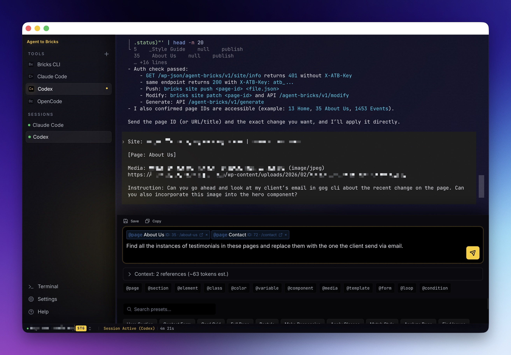

# Agent to Bricks

Give any AI coding agent direct access to your Bricks Builder site. Build pages, migrate content, and orchestrate multi-tool workflows — all from a single prompt.

CLI, Desktop App, and WordPress Plugin for [Bricks Builder](https://bricksbuilder.io/).

## Components

| Component | Description |
|-----------|-------------|
| **CLI** | Terminal tool for page operations, HTML conversion, search, and templates |
| **Desktop App** | Visual session manager for AI coding tools (Claude Code, Codex, etc.) |
| **WordPress Plugin** | REST API bridge to your Bricks Builder site |
| **[Documentation](https://agenttobricks.com)** | Full guides, references, and tutorials |

### Desktop App


### CLI


### WordPress Plugin


## Quick Start

### 1. Install the plugin

Download the plugin ZIP from the [latest release](https://github.com/nerveband/agent-to-bricks/releases/latest) and upload it in WordPress under **Plugins > Add New > Upload Plugin**. Then go to **Settings > Agent to Bricks** and generate an API key.

### 2. Install the CLI

Download the binary for your platform from the [latest release](https://github.com/nerveband/agent-to-bricks/releases/latest):

```bash
# Mac / Linux
tar xzf agent-to-bricks_*.tar.gz
sudo mv bricks /usr/local/bin/
```

### 3. Connect

```bash
bricks config init          # interactive setup
bricks site info            # verify connection
```

### 4. Build something

```bash
bricks pull 42 --format html         # get current page
# ... let your AI agent edit the HTML
bricks convert html edited.html --push 42 --snapshot   # push changes
```

[Full installation guide](https://agenttobricks.com/getting-started/installation/) | [Quick start](https://agenttobricks.com/getting-started/quick-start/)

## Documentation

All documentation lives at **[agenttobricks.com](https://agenttobricks.com)**:

- [Getting Started](https://agenttobricks.com/getting-started/introduction/)
- [CLI Reference](https://agenttobricks.com/cli/site-commands/)
- [Desktop App Guide](https://agenttobricks.com/gui/overview/)
- [Plugin Reference](https://agenttobricks.com/plugin/rest-api/)
- [Guides](https://agenttobricks.com/guides/bring-your-own-agent/)

## Updating

```bash
bricks update              # update CLI + plugin
bricks update --check      # check without installing
```

The Desktop App checks for updates automatically on launch.

## Requirements

- WordPress 6.0+ with Bricks Builder 1.9+
- PHP 8.0+
- Optional: Automatic.css 3.x for design token support

## For Contributors

```bash
make build          # build CLI binary
make test           # run Go tests
make sync-version   # sync VERSION across all components
make check-version  # verify version consistency
```

[Contributing guide](https://agenttobricks.com/about/contributing/)

## License

GPL-3.0
