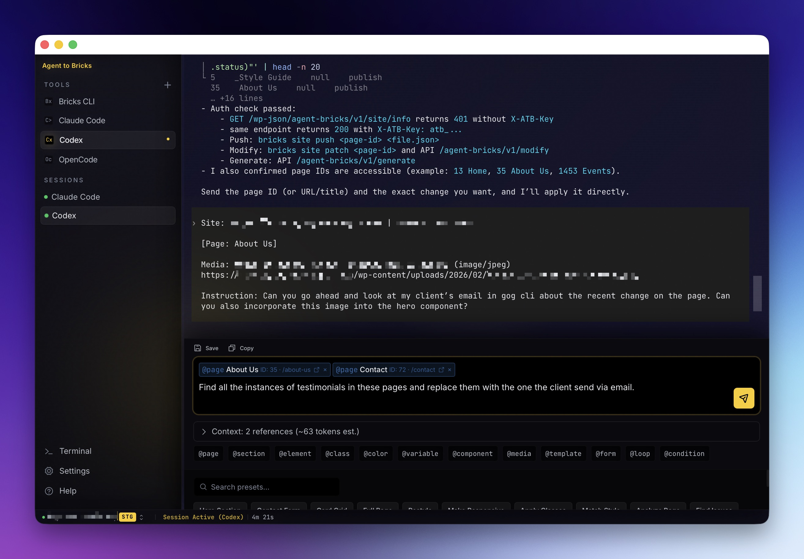
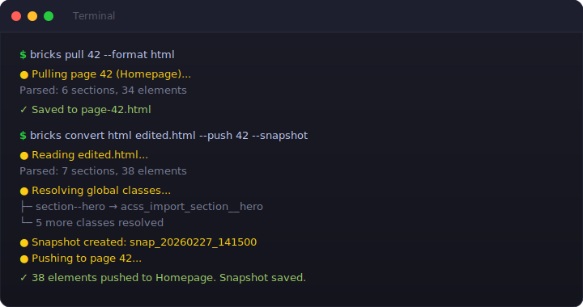
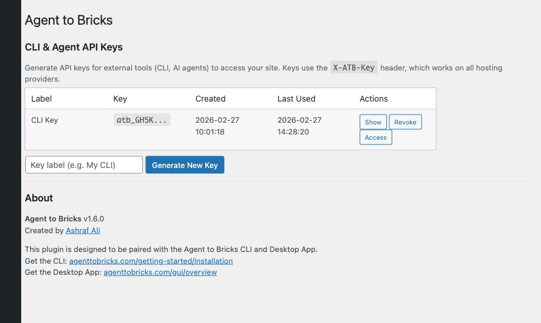

# Agent to Bricks

Give any AI coding agent direct access to your Bricks Builder site. Build pages, migrate content, and orchestrate multi-tool workflows — all from a single prompt.

CLI, Desktop App, and WordPress Plugin for [Bricks Builder](https://bricksbuilder.io/).

## Components

| Component | Description |
|-----------|-------------|
| **CLI** | Terminal tool for page operations, HTML conversion, search, and templates |
| **Desktop App** | Visual session manager for AI coding tools (Claude Code, Codex, etc.) |
| **WordPress Plugin** | REST API bridge to your Bricks Builder site |
| **[Documentation](https://agenttobricks.com)** | Full guides, references, and tutorials |

### Desktop App


### CLI


### WordPress Plugin


## Quick Start

### 1. Install the plugin

Download the plugin ZIP from the [latest release](https://github.com/nerveband/agent-to-bricks/releases/latest) and upload it in WordPress under **Plugins > Add New > Upload Plugin**. Then go to **Settings > Agent to Bricks** and generate an API key.

### 2. Install the CLI

Download the binary for your platform from the [latest release](https://github.com/nerveband/agent-to-bricks/releases/latest):

```bash
# macOS (Apple Silicon)
tar xzf agent-to-bricks_*.tar.gz
mv bricks /opt/homebrew/bin/

# Linux
tar xzf agent-to-bricks_*.tar.gz
mv bricks ~/.local/bin/
```

### 3. Connect

```bash
bricks config init          # interactive setup
bricks site info            # verify connection
```

### 4. Build something

```bash
bricks pull 42 --format html         # get current page
# ... let your AI agent edit the HTML
bricks convert html edited.html --push 42 --snapshot   # push changes
```

[Full installation guide](https://agenttobricks.com/getting-started/installation/) | [Quick start](https://agenttobricks.com/getting-started/quick-start/)

## Documentation

All documentation lives at **[agenttobricks.com](https://agenttobricks.com)**:

- [Getting Started](https://agenttobricks.com/getting-started/introduction/)
- [CLI Reference](https://agenttobricks.com/cli/site-commands/)
- [Desktop App Guide](https://agenttobricks.com/gui/overview/)
- [Plugin Reference](https://agenttobricks.com/plugin/rest-api/)
- [Guides](https://agenttobricks.com/guides/bring-your-own-agent/)

## Updating

```bash
bricks update              # update CLI + plugin
bricks update --check      # check without installing
```

The Desktop App checks for updates automatically on launch.

## Latest Release

### v2.0.0

- Breaking API hardening: page patch requests now use `patches` only, matching the plugin and docs contract.
- Staging is now a real release gate: shared env-driven fixture config, deploy verification, plugin runner matrix, CLI E2E, GUI E2E, and template smoke coverage.
- Private Bricks template corpora under `docs/test-data/` are supported for local validation without forcing proprietary fixtures into public clones.
- GUI session bootstrap no longer injects raw site API keys into agent prompts; typed staging checks and release verification scripts are included in-repo.

See [CHANGELOG.md](CHANGELOG.md) for the full release summary.

## Key Features

- **Machine-Readable CLI** — `bricks schema` outputs a JSON manifest of all commands. Structured error codes, `--format json` on every command, and stdin pipelines make the CLI fully automatable by AI agents.
- **WordPress Abilities API** — Auto-discovers plugin abilities (Yoast, WooCommerce, Gravity Forms, etc.) and includes them in AI prompts. Requires WordPress 6.9+.
- **CSS Framework Support** — Scans ACSS, Cwicly, and theme CSS files for custom properties. Colors and variables appear in `@color` and `@variable` autocomplete.
- **Page-Specific @mentions** — `@element` and `@section` use a two-step flow: pick a page, then browse elements within it.
- **41 E2E Tests** — Automated test suite via `tauri-plugin-mcp` covering all GUI features against the live staging site.

## Core Philosophy

- **ShipTypes-style contract-first design** — public CLI, plugin, and GUI behavior should be typed, machine-readable, and discoverable without relying on prose scraping.
- **`agent-dx-cli-scale` discipline** — changes should preserve or improve JSON-first I/O, raw payload paths, schema validation, stable errors, safety rails, and context-window discipline.
- **No silent structured-content corruption** — avoid naive regex or delimiter splitting that can rewrite valid CSS, HTML, JSON, URLs, or other structured payloads in transit.

## Requirements

- WordPress 6.0+ with Bricks Builder 1.9+
- PHP 8.0+
- Optional: Automatic.css 3.x for design token support

## For Contributors

```bash
make build          # build CLI binary
make test           # run Go tests
make sync-version   # sync VERSION across all components
make check-version  # verify version consistency
```

[Contributing guide](https://agenttobricks.com/about/contributing/)

## License

GPL-3.0
